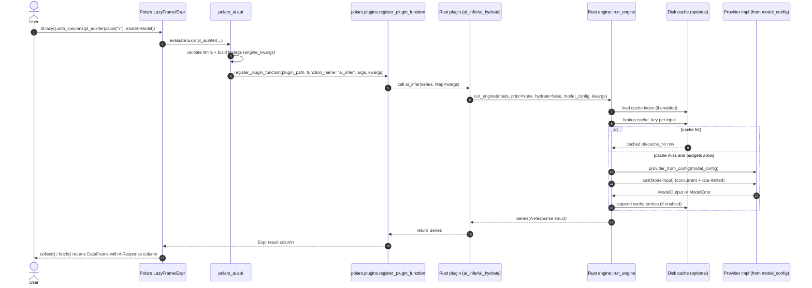

# polars-ai

`polars-ai` runs provider-backed model inference over Polars expressions, returning resumable, cached, metered `AiResponse` structs.

The public API is intentionally small:

- `Model` configs: `OpenAIModel`, `AnthropicModel`, `GeminiModel`, and `FakeModel`.
- `infer(...)`: run inference over a Polars expression.
- `hydrate(...)`: complete incomplete `AiResponse` rows later.

## Install Locally

```bash
python -m venv .venv
source .venv/bin/activate
pip install maturin
maturin develop --extras examples
```

## Basic Usage

```python
import polars as pl
import polars_ai as pl_ai

model = pl_ai.OpenAIModel(
    name="gpt-4o-mini",
    prompt="Classify sentiment: {value}",
    tag="sentiment-v1",
)

df = pl.LazyFrame({"review": ["Great battery life", "The lid leaks"]}).with_columns(
    pl_ai.infer(pl.col("review"), model=model, cache_path="cache/").alias("ai")
).collect()

decoded = df.select(
    pl.col("ai").struct.field("status").alias("status"),
    pl.col("ai").struct.field("value").alias("sentiment"),
    pl.col("ai").struct.field("cache_key").alias("cache_key"),
    pl.col("ai").struct.field("cost_usd").alias("cost_usd"),
)
```

## Model Configs

Models are serializable configs, not subclass hooks. Rust only executes providers implemented by the package.

```python
pl_ai.OpenAIModel(name="gpt-4o-mini", prompt="Summarize: {value}", tag="summary-v1")
pl_ai.AnthropicModel(name="claude-3-5-haiku-latest", prompt="Summarize: {value}", tag="summary-v1")
pl_ai.GeminiModel(name="gemini-1.5-flash", prompt="Summarize: {value}", tag="summary-v1")
pl_ai.FakeModel(prompt="Test: {value}", tag="local-test")
```

Provider keys are read from `OPENAI_API_KEY`, `ANTHROPIC_API_KEY`, `GEMINI_API_KEY`, or `GOOGLE_API_KEY`. `FakeModel` makes deterministic local responses for tests and examples.

## AiResponse

`infer(...)` and `hydrate(...)` return a Polars `Struct` matching `pl_ai.AiResponse`:

- `status`: `ok`, `cache_hit`, `budget_exhausted`, `model_error`, or `invalid_context`.
- `value`: provider text when the row completed.
- `error`: provider or validation error details.
- `cache_key`: deterministic fingerprint of cache-key schema, model config, and normalized input.
- `attempts`, `created_at`, `completed_at`: execution bookkeeping.
- `input_tokens`, `output_tokens`, `total_tokens`, `cost_usd`: metering fields.

Use Polars struct accessors directly:

```python
df.select(
    pl.col("ai").struct.field("status"),
    pl.col("ai").struct.field("value"),
)
```

## Budgets, Cache, And Hydration

```python
model = pl_ai.FakeModel(prompt="Label: {value}", tag="demo")

partial = (
    pl.LazyFrame({"text": ["a", "b", "c"]})
    .with_columns(
        pl_ai.infer("text", model=model, cache_path="cache/", max_requests=1).alias("ai")
    )
    .collect()
)

finished = partial.with_columns(
    pl_ai.hydrate(
        response="ai",
        input="text",
        model=model,
        cache_path="cache/",
        max_requests=10,
    ).alias("ai")
)
```

Hydration preserves terminal rows and spends the new budget only on incomplete rows. Cache hits do not consume `max_requests`.

Guardrails supported by both `infer(...)` and `hydrate(...)`:

- `max_requests`: maximum new provider calls.
- `max_tokens`: rough cumulative input-token budget.
- `max_concurrency`: maximum in-flight provider calls.
- `rate_limit_per_second`: local pacing before provider calls.


<!-- ## Grouped And Multimodal Inputs

Grouped text inference works on ordinary list expressions:

```python
by_topic = df.group_by("topic").agg(
    pl_ai.infer(
        pl.col("note").implode(),
        model=summary_model,
        text_separator="

",
        number_text_items=True,
    ).alias("ai")
)
```

Non-text inputs use `input_type`:

```python
pl_ai.infer(pl.col("image_url"), model=model, input_type="image_url")
pl_ai.infer(pl.col("image_b64"), model=model, input_type="image", mime="image/png")
pl_ai.infer(pl.col("image_path"), model=model, input_type="image_path", mime="image/jpeg")
``` -->

## Examples

```bash
marimo edit examples/01_quickstart.py
```

The examples cover the simple inference path, budgets/cache, hydration, grouped inputs, and image input options.


# Architecture 



# Comparable Packages

## GABRIEL

[GABRIEL](https://github.com/openai/GABRIEL) is a Python toolkit that turns unstructured text, images, and audio into analysis-ready DataFrames by wrapping GPT calls in a library of opinionated research verbs (rate, rank, classify, extract, dedupe, and more) with built-in prompting, batching, retries, and checkpointing.

| Dimension | **GABRIEL** | **polars-ai** |
|---|---|---|
| **Mental model** | "A library of *measurements* (rate, rank, classify, extract, dedupe...)" | "A Polars expression that calls a model" |
| **Data frame** | pandas | Polars (lazy + eager) |
| **Prompting** | Opinionated, task-specific Jinja templates baked into each verb | One free-form `prompt="...{value}..."` template per `Model` config |
| **Output shape** | A tidy DataFrame with task-shaped columns (e.g. one column per attribute) | A Polars `Struct` column (`AiResponse`) with `status`, `value`, `cost_usd`, `cache_key`, token counts, timestamps, etc. |
| **Resumability** | File-based checkpointing in `save_dir` (raw responses on disk, resume by leaving `reset_files=False`) | Content-hashed cache directory + `hydrate(...)` to top up incomplete rows |
| **Audience** | Social scientists, qual-data analysts | Polars-native data engineers / ML pipelines |
